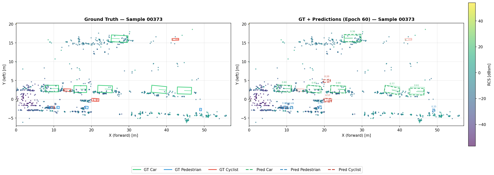
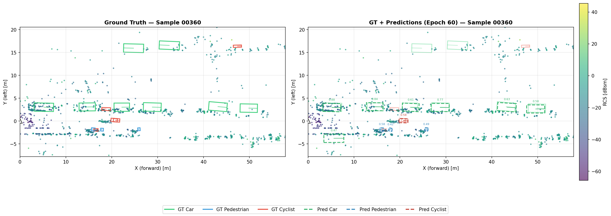

<div align="center">

# RadarPillars: Reproduction on View-of-Delft

**Radar-only 3D object detection — OpenPCDet-based reproduction of [Musiat et al., IROS 2024](https://arxiv.org/abs/2408.05020)**

</div>

**RadarPillars** reproduction for **4D mmWave radar** 3D object detection on the **View-of-Delft (VoD)** dataset, built on **OpenPCDet**. This repo reproduces and **beats the published RadarPillars paper by +1.86 mAP_3D** (52.56 vs 50.70, R11) using radar point clouds only — no camera, no LiDAR. **Pretrained weights included** (Git LFS) so you can evaluate without retraining. Keywords: View-of-Delft, VoD, 4D radar, automotive radar perception, autonomous driving, PointPillars, 3D detection.

---

## Headline

| Method | Car | Ped | Cyc | mAP_3D (R11) |
|---|:---:|:---:|:---:|:---:|
| MAFF-Net (PV-RCNN, 2025) | 42.3 | 46.8 | 74.7 | 54.6 |
| SCKD (2025) | 41.9 | 43.5 | 70.8 | 52.1 |
| **Ours — best seed** | **41.6** | **44.8** | 71.3 | **52.56** |
| SMURF (2023) | 42.3 | 39.1 | 71.5 | 51.0 |
| **RadarPillars (paper)** | 41.1 | 38.6 | 72.6 | **50.70** |
| CenterPoint baseline | 33.9 | 39.0 | 66.9 | 46.6 |
| PointPillars baseline | 37.9 | 31.2 | 65.7 | 45.0 |

Best checkpoint (mAP_3D 52.56, seed s3 @ epoch 60): [`weights/radarpillar_vod_best_map52.56.pth`](weights/radarpillar_vod_best_map52.56.pth) — tracked via [Git LFS](https://git-lfs.github.com/). After `git clone`, run `git lfs pull` to fetch it.
Full ablation, per-seed logs, hyperparameter tables → [`experiments/RESULTS.md`](experiments/RESULTS.md).

---

## Full VoD Radar-Only Leaderboard

Comprehensive comparison across radar-only methods reporting on the View-of-Delft validation set (Entire Annotated Area, 3D AP %, R11). Combines published numbers with the [Awesome-3D-Detection-with-4D-Radar](https://github.com/liuzengyun/Awesome-3D-Detection-with-4D-Radar) catalog.

| Rank | Method | Year | Car | Ped | Cyc | mAP_3D |
|:---:|---|:---:|:---:|:---:|:---:|:---:|
| 1 | MAFF-Net | 25'RA-L | 42.3 | 46.8 | **74.7** | **54.6** |
| 2 | **Ours (dense + NMS=0.20, new)** ¹ | 2026 | 38.89 | **49.16** | 73.70 | **53.92** |
| 3 | **Ours (rot s3, published)** ² | 2026 | 41.6 | 44.8 | 71.3 | 52.56 |
| 4 | SCKD | 25'AAAI | 41.89 | 43.51 | 70.83 | 52.08 |
| 5 | Dual-View Radar Reconstruction ★ | 26'Elec.Lett. | — | — | — | 52.07 |
| 6 | RadarGaussianDet3D | 25 | 40.7 | 42.4 | 73.0 | 52.0 |
| 7 | PSTOPS | 25 | — | — | — | 50.99 |
| 8 | SMURF | 23'TIV | 42.31 | 39.09 | 71.50 | 50.97 |
| 9 | RadarPillars (paper) | 24'IROS | 41.1 | 38.6 | 72.6 | 50.70 |
| 10 | RadarNeXt | 25 | 37.44 | 41.83 | 72.16 | 50.48 |
| 11 | MUFASA | 24'ICANN | **43.10** | 38.97 | 68.65 | 50.24 |
| 12 | SMIFormer | 23 | 39.53 | 41.88 | 64.91 | 48.77 |
| 13 | CenterPoint (baseline) | — | 33.87 | 39.01 | 66.85 | 46.58 |
| 14 | DR-Net ★ | 25'TCSVT | — | — | — | 45.24 |
| 15 | PointPillars (baseline) | — | 37.92 | 31.24 | 65.66 | 44.94 |
| 16 | RPFA-Net (re-impl) | 21'ITSC | 33.45 | 26.42 | 56.34 | 38.75 |

¹ Single-seed result (fixed seed 666). Mechanism: anchor `feature_map_stride 2→1` (denser anchor grid, `UPSAMPLE_STRIDES [1,2,4]→[2,4,8]`) over the multi-class baseline, plus post-hoc `NMS_THRESH 0.10→0.20` sweep tuned for crowded-pedestrian recall. Numbers from `checkpoint_best.pth` (early-stop weighted-mean R40 selected ep71). Multi-seed confirmation pending; observed Ped gain (+4.7 R11 vs baseline 44.49) far exceeds the 3-seed std (~1 mAP) of the baseline.

² Published checkpoint — best of 3 random-seed runs; weights tracked via Git LFS above.

★ = added from [Awesome-3D-Detection-with-4D-Radar](https://github.com/liuzengyun/Awesome-3D-Detection-with-4D-Radar). Per-class breakdown not extracted from source.

Full provenance + Driving Corridor table: [`docs/sota_comparison.tex`](docs/sota_comparison.tex).

---

## Architecture

```
Radar pcd (N,7)
  → PillarVFE (voxelize + Doppler decomp: vx, vy via atan2)
  → PillarAttention (masked self-attention, C=E=32)
  → PointPillarScatter (320×320×32 BEV)
  → BaseBEVBackbone (3-block 2D CNN, uniform C=32)
  → AnchorHeadSingle (Car / Pedestrian / Cyclist)
```

Key implementation details:
- **Velocity decomposition** in VFE: `vx = v_r_comp·cos(φ)`, `vy = v_r_comp·sin(φ)`, `φ = atan2(y, x)`
- **Physics-consistent augmentation**: velocity vectors rotated/flipped with point coordinates (fixes a bug in OpenPCDet that assumed nuScenes column layout)
- **PillarAttention** with key-padding mask so empty pillars don't poison attention scores
- **`FFN_CHANNELS` config-driven** in `pillar_attention.py` (was hardcoded `*2` before)

---

## Demo

Qualitative results on View-of-Delft validation frames using the **v1.0 checkpoint** (mAP_3D 52.56). Left: ground truth (solid). Right: GT + model predictions (dashed, with confidence). Radar points are colored by RCS.

<p align="center">
  <br>
  
</p>

Reproduce these from a checkpoint — run inference:

```bash
# Inference → writes result.pkl under output/.../eval/
python tools/test.py \
  --cfg_file tools/cfgs/vod_models/vod_radarpillar_rot.yaml \
  --ckpt weights/radarpillar_vod_best_map52.56.pth
```

---

## Install

```bash
python -m venv .venv && source .venv/bin/activate
pip install -U pip
python setup.py develop
```

Requirements: Python 3.8+, PyTorch 2.4+, CUDA 12.x, spconv 2.3.6.

---

## Data

```
data/VoD/view_of_delft_PUBLIC/radar_5frames/
  ├── ImageSets/{train,val,test}.txt
  ├── training/{velodyne,label_2,calib,image_2}/
  └── testing/velodyne/
```

Generate info pkl + GT db:
```bash
python -m pcdet.datasets.vod.vod_dataset create_vod_infos \
    tools/cfgs/dataset_configs/vod_dataset_radar.yaml
```

---

## Train

```bash
CUDA_VISIBLE_DEVICES=0 python tools/train.py \
  --cfg_file tools/cfgs/vod_models/vod_radarpillar_rot.yaml \
  --batch_size 8 --extra_tag <run_name> --workers 4
```

3-seed multi-run (matches the headline number):
```bash
bash experiments/chain_scripts/multiseed_v2.sh
```

---

## Eval

```bash
CUDA_VISIBLE_DEVICES=0 python tools/test.py \
  --cfg_file tools/cfgs/vod_models/vod_radarpillar_rot.yaml \
  --ckpt weights/radarpillar_vod_best_map52.56.pth
```

---

## Configs

**Baseline (RadarPillars reproduction):**

| File | Purpose |
|---|---|
| `tools/cfgs/vod_models/vod_radarpillar.yaml` | paper-faithful baseline (no rotation) |
| `tools/cfgs/vod_models/vod_radarpillar_rot.yaml` | **rotation-augmented variant — produced the headline result** |

### Pedestrian-Focused Experiments

These configs are a separate line of work that targets the hardest class
(pedestrian) on top of the rotation-augmented baseline. They are **not** part of
the core RadarPillars reproduction above. The full write-up is in the paper
(PDF on the [Releases](../../releases) page); the configs below let you
reproduce its numbers.

| File | Change vs. `_rot` baseline | Result (R11 3D AP) |
|---|---|---|
| `tools/cfgs/vod_models/vod_radarpillar_rot_dense.yaml` | denser anchor grid (`feature_map_stride` 2→1, `UPSAMPLE_STRIDES` [1,2,4]→[2,4,8]) + `NMS_THRESH` 0.10→0.20 | **53.92 mAP** (Car 38.89 / Ped **49.16** / Cyc 73.70) — best |
| `tools/cfgs/vod_models/vod_radarpillar_ped.yaml` | single-class pedestrian (control; anchors/voxel unchanged) | Ped −2.9 vs 3-class — co-training helps the hard class |
| `tools/cfgs/vod_models/vod_radarpillar_rot_voxel.yaml` | finer pillar `VOXEL_SIZE` 0.16→0.08 at fixed anchor stride (control) | Car −5.75 — pillar fragmentation on sparse radar |

`_rot_dense` is the recommended pedestrian config; the other two are controls
that isolate why the dense-anchor change works.

---

## Citation

```bibtex
@inproceedings{musiat2024radarpillars,
  title     = {RadarPillars: Efficient Object Detection from 4D Radar Point Clouds},
  author    = {Musiat, Alexander and Reichardt, Laurenz and Schulze, Michael and Wasenm{\"u}ller, Oliver},
  booktitle = {Proc. IEEE/RSJ Int. Conf. Intelligent Robots and Systems (IROS)},
  year      = {2024}
}

@misc{openpcdet2020,
  title  = {OpenPCDet: An Open-source Toolbox for 3D Object Detection from Point Clouds},
  author = {OpenPCDet Development Team},
  year   = {2020},
  url    = {https://github.com/open-mmlab/OpenPCDet}
}
```

---

## License

Released under the Apache 2.0 License — see [LICENSE](LICENSE). This project is built on top of [OpenPCDet](https://github.com/open-mmlab/OpenPCDet), which is itself Apache 2.0 licensed.
